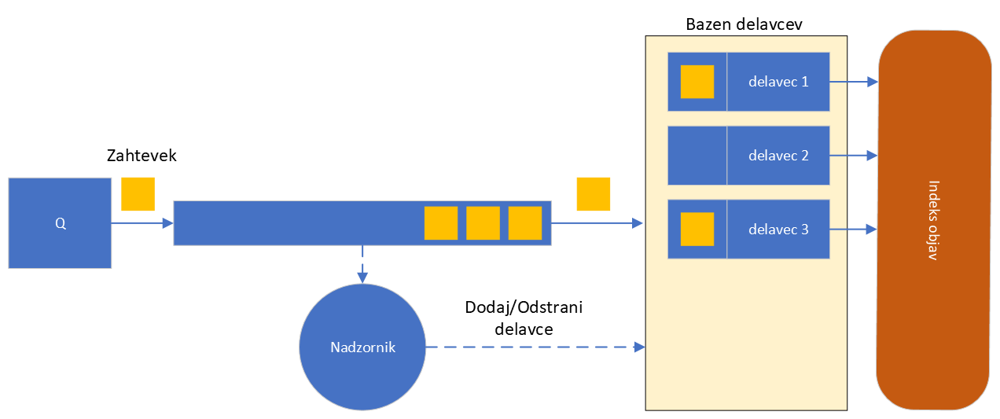

# 2. Domača naloga: Indeksiranje in iskanje po objavah na socialnem omrežju Q

**Rok za oddajo: 8. 12. 2024**

Izmišljenemu socialnemu omrežju **Q** želimo dodati storitev, ki bo omogočala iskanje s ključnimi besedami po naboru objav. **Q** bomo simulirali lokalno s pomočjo paketa [socialNetwork](./koda/socialNetwork/). Vse objave so v obliki nalog posredovane servisu, ki jih mora ustrezno indeksirati. Posamezen zahtevek je opisan s podatkovno strukturo 

```Go
type Task struct {
	Id       uint64
	Data     string
}
```
Pomen posameznih polj:
 - Polje `Id`: identifikator objave
 - Polje `Data`: v tem polju se nahaja vsebina objave, ki jo želimo indeksirati. 

**Procesiranje zahtevka:**

Ko dobimo zahtevek, je naša naloga, da najprej iz besedila objave izluščimo ključne besede. To storimo tako, da iz besedila **odstranimo vsa ločila in ostale posebne znake** in spremenimo vse znake v **male tiskane črke**. Nato iz besedila izluščino vse besede, ki so **dolge vsaj 4 znake** in jih dodamo v indeks ključnih besed. Indeks ključnih besed deluje po principu [obrnjenega kazala](https://en.wikipedia.org/wiki/Inverted_index) (angl. Inverted Index), kjer za vsako ključno besedo hranimo seznam objav, v katerih se beseda pojavi. V kazalu, torej za vsako ključno besedo hranimo `Id`-je vseh objav, v katerih se je pojavila.


**Obdelava zahtevkov**

Zahtevke naj obdeluje več delavcev, katerih število naj se dinamično prilagaja glede na količino prejetih zahtevkov.

Storitev indeksiranja, naj vedno začne z enim delavcem in dodaja nove, če se začnejo objave v vrsti za procesiranje nabirati. Vrsta preko katere prihajajo zahtevki ima kapaciteto 10000. V kolikor, zahtevke obdeluje premalo delavcev, se bo vrsta polnila, dokler ne doseže maksimalne kapacitete. Če pa je delavcev preveč, se bo vrsta hitro spraznila in bodo delavci večino časa samo čakali na nove objave. Doseči želimo približno ravnovesje, tako da nimamo odvečnih delavcev, ki zasedajo sistemske vire, hkrati pa nočemo, da bi zahtevki predolgo časa čakali v vrsti oziroma bi jih storitev celo zavračala.

Prilagajanje števila delavcev dosežemo s pomočjo nadzorne gorutine (nadzornika), ki spremlja dolžino vrste in ustvarja oziroma ukinja delavce glede na to ali se čakalna vrsta hitro povečuje, ali zmanjšuje. 

Spodnja slika prikazuje shematski prikaz storitve indeksiranja, kjer socialno omrežje **Q** generira zahtevke, ki prihajajo v čakalno vrsto. Delavci na drugi strani prevzemajo zahtevke in jih dodajajo v indeks. Nadzornik periodično preverja dolžino čakalne vrste in po potrebi prilagaja število delavcev.

**Napotki**

 - Za hranjenje obrnjenega slovarja uporabite podatkovno strukturo slovar tipa `map[string][]uint64` v katerega dodajate `Id` objav, ki vsebujejo neko ključno besedo.
 - V slovar bo hkrati zapisovalo več delavcev, pazite na hkratne dostope.
 - Samo določite kriterij po katerem nadzornik dodaja oziroma odstranjuje delavce. Prav tako morate določiti kako pogosto bo preverjal stanje. Eksperimentirajte!
 - Najmanjše število delavcev je ena, največje pa naj bo prav tako omejeno. Hitrost procesiranja se povečuje samo do nekega števila delavcev. Preverite kako se vaša rešitev obnaša.
 - Preizkusite različne vrednosti `delay`. Za majhne vrednosti `delay` bo vrsta vedno polna, ker je generiranje zahtevkov prehitro, ne glede na količino delavcev. Za velike vrednosti pa bo vrsta večinoma prazna. Smiselne vrednosti se nahajajo v območju `[1000,10000]`.
 - Na koncu preverite, da so delavci obdelali vse zahtevke. Vrsta se mora do konca izprazniti preden se program zaključi.
 - Izpišite povprečno dolžino vrste, največjo dolžino vrste in hitrost procesiranja zahtevkov.
 - Izpišite tudi dinamiko dodajanja in odstranjevanja delavcev. Iz tega izpisa bo razvidno kako se nadzornik odziva obrementitev.
 - Na zagovoru delovanje vašega programa demonstrirajte na gruči Arnes. Pri zaganjanju na računskih vozliščih uporabite stikalo `--cpus-per-task`, da nastavite število procesorskih jeder, ki so na volju programu.



**Uporaba paketa `socialNetwork`**

Znotraj mape [koda](./koda/) se nahaja mapa `socialNetwork`, ki vsebuje generator zahtevkov. Prenesite jo v vašo delovno mapo in znotraj delovne mape zaženite ukaz
```bash
$ go mod init <ime_projekta>
```

sedaj v stavku import dodate paket
```Go
import (
    "<ime_projekta>/socialNetwork"
)
```
Nov generator definirate na naslednji način:
```Go
var producer socialNetwork.Q
```
V podatkovni strukturi `Q` so na volja naslednja polja
```Go
type Q struct {
	N              uint64
	TaskChan       chan Task
}
```
- Polje `N`: vsebuje število generiranih zahtevkov
- Polje `TaskChan`: kanal v katerega se zapisujejo generirani zahtevki, kanal ima kapaciteto 10000 zahtevkov

Paket `socialNetwork` vsebuje še nekaj metod za zagon in ustavitev generiranja zahtevkov, ter beleženje statistike:
 - Metoda `New(delay int)` Inicializira generator. Kot argument ji podamo vrednost `delay`, ki določa zakasnitev med posameznimi zahtevki. S tem kontroliramo kako hitro se generirajo novi zahtevki. Smiselne vrednosti so 1000-10000. 
 - Metoda `Run()` zažene generator zahtevkov.
 - Metoda `Stop()` ustavi generiranje zahtevkov.
 - Metoda `GetAverageQueueLength() float64` vrne povprečno dolžino čakalne vrste v % glede na kapaciteto vrste.
 - Metoda `GetMaxQueueLength() int` vrne največje število zahtevkov v čakalnici v % glede na kapaciteto vrste.
 - Metoda `QueueEmpty() bool` preveri če je čakalna vrsta prazna.


Primer uporabe generatorja zahtevkov znotraj programa:
```Go
/*
Primer uporabe paketa socialNetwork
*/
package main

import (
	"fmt"
	//Uvozimo paket socialNetwork (ustrezno popravite glede na ime projekta)
	"naloga2/socialNetwork"
	"time"
)

func main() {
	// Definiramo nov generator
	var producer socialNetwork.Q
	// Inicializiramo generator. Parameter določa zakasnitev med zahtevki
	producer.New(5000)

	start := time.Now()
	// Delavec, samo prevzema zahtevke
	go func() {
		for {
			<-producer.TaskChan
		}
	}()
	// Zaženemo generator
	go producer.Run()
	// Počakamo 5 sekund
	time.Sleep(time.Second * 5)
	// Ustavimo generator
	producer.Stop()
	// Počakamo, da se vrsta sprazni
	for !producer.QueueEmpty() {
	}
	elapsed := time.Since(start)
	// Izpišemo število generiranih zahtevkov na sekundo
	fmt.Printf("Processing rate: %f MReqs/s\n", float64(producer.N)/float64(elapsed.Seconds())/1000000.0)
	// Izpišemo povprečno dolžino vrste v čakalnici
	fmt.Printf("Average queue length: %.2f %%\n", producer.GetAverageQueueLength())
	// Izpišemo največjo dolžino vrste v čakalnici
	fmt.Printf("Max queue length %.2f %%\n", producer.GetMaxQueueLength())
}
```
