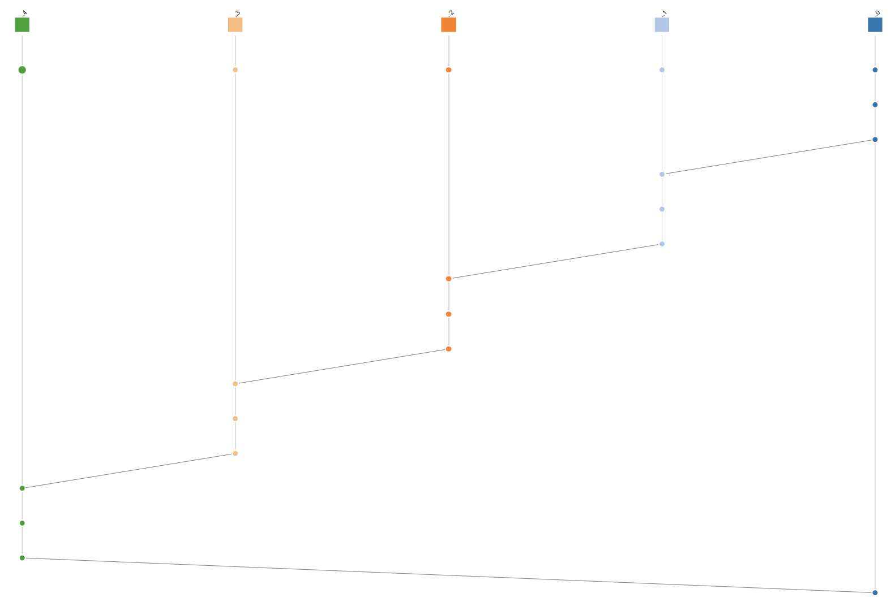

# 3. Domača naloga: Razširjanje sporočil z govoricami

**Rok za oddajo: 17. 12. 2024**

Na podlagi [razlage](../07-razsirjanje-sporocil/Razsirjanje-sporocil.md), želimo poustvariti protokol za razširjanje sporočil med procesi. Uporabili bomo pristop **razširjanja z govoricami**.

Vaša naloga je napisati program v **go** za razširjanje sporočil med procesi in ga preizkusiti na **gruči Arnes**. Program naj preko ukazne vrstice prejme naslednje argumente (lahko tudi dodatne, če jih potrebujete):
- identifikator procesa `id`: celo število, ki identificira posamezen proces znotraj skupine,
- število vseh procesov v skupini `N`,
- število različnih zaporednih sporočil `M`, ki jih bo glavni proces razširil med ostale. Vsebina posameznega sporočila je enaka zaporedni številki sporočila: Najprej se razširi sporočilo z vsebino `1`, nato `2`, vse do `M`.
- število sporočil `K`, ki jih bo vsak proces ob prvem prejemu posredoval ostalim.  

Procesi naj za komunikacijo uporabljajo protokol **UDP**. Vsak proces naj ob **prvem** prejemu novega sporočila to izpiše na zaslon. Razširjanje sporočila naj vedno začne proces z `id==0`. Med posamezna pošiljanja dodajte kratko pavzo (reda 100 ms). Pri razširjanju ni potrebno skrbeti za pravilen vrstni red prejema. Vsak proces ob **prvem** prejemu novega sporočila, le-tega posreduje naprej `K` naključno izbranim procesom. Pri naključnem izbiranju procesov poskrbite, da posamezen proces ne izbere istega procesa večkrat. 

Vašemu programu dodajte mehanizem za spremljanje vrstnega reda dogodkov s pomočjo [vektorskih ur](../../predavanja/13-merjenje-casa/merjenje-casa.md) kot je podano v [zgledu](../../predavanja/13-merjenje-casa/koda/vektorska-ura/vektorska-ura.go) iz predavanj. Uporabite paket `github.com/DistributedClocks/GoVector/govec`. Dokumentacijo o paketu najdete na [povezavi](https://pkg.go.dev/github.com/DistributedClocks/GoVector/govec?utm_source=godoc). Paket si najprej namestite s pomočjo ukaza:
```
go install github.com/DistributedClocks/GoVector
```

Kot dogodke zabeležite: 
 - pripravo sporočila za pošiljanje (metoda `LogLocalEvent`)
 - pošiljanje sporočila (metoda `PrepareSend`)
 - prejem sporočila (metoda `UnpackReceive`)
  
Generirajte dnevnike in jih združite s pomočjo programa `GoVector`, ki je del paketa `govec`. Primer ukaza za združevanje dnevnikov: 
```
~/go/bin/GoVector --log_type shiviz --log_dir . --outfile Log-full.log
```
Dnevnik vizualizirajte s pomočjo spletne aplikacije [ShiViz](https://bestchai.bitbucket.io/shiviz/) 

Vizualizacija za primer [telefon](./koda/telefon.go) iz prejšnjih vaj:


Pri pisanju programa se lahko zgledujete po [kodi](./koda/telefon.go) iz prejšnjih vaj. V mapi s primerom ustvarite projekt in povežite ustrezne pakete:
```
go mod init telefon
go mod tidy
```

Pri poslušanju za sporočila je priporočeno, da nastavite rok trajanja povezave s pomočjo metode [SetDeadline](https://pkg.go.dev/net#IPConn.SetDeadline) ali pa kako drugače poskrbite, da se proces zaključi in sprosti vrata, če po nekem času ne dobi sporočila. S tem se boste izognili težavam z zasedenostjo vrat v primeru, da pride do smrtnega objema, ko nek proces čaka na sporočilo, ki nikoli ne pride. V procesih ni potrebno uporabiti principa preverjanja utripa za ugototavljanje, če so procesi prejemniki pripravljeni oziroma živi. Glavni proces naj kar takoj začne pošiljati sporočila. 

Za zaganjanje poljubnega števila procesov na gruči Arnes se lahko zgledujete po [skripti](./koda/run_telefon.sbatch). Vrata preko katerih vaši procesi komunicirajo spremenite, da se izognete težavam, kjer vas več uporablja ista vrata za komunikacijo.