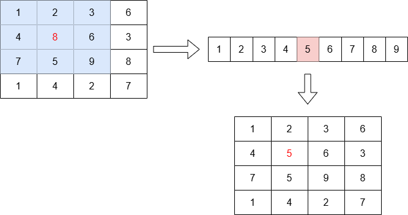
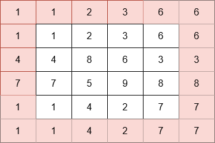

# 5. Domača naloga: Filtriranje slik z mediano

**Rok za oddajo: 14. 1. 2024**

[Filitriranje z mediano](https://en.wikipedia.org/wiki/Median_filter) je postopek za odstranjevanje šuma v signalih. Pogosto se uporablja za predprocesiranje slik za pripravo za nadaljnje analize ali za izboljšanje vizualne kakovosti. Njegova prednost je, da ohranja robove in podrobnosti v slikah. Osnovna ideja je zamenjati vrednosti posamezne slikovne točke z mediano vrednosti točk v njeni okolici. Tipično se uporablja okno velikosti 3x3 ali 5x5 slikovnih točk.

Zašumljena slika             |  Slika po filtriranju z mediano
:-------------------------:|:-------------------------:
  |  

## Postopek

* Filtriranje z mediano bomo zaradi enostavnosti izvajali nad sivinskimi slikami. Če slika ni sivinska jo naprej pretvorimo v sivinsko. Primer kako to naredimo v go, najdete [tukaj](./koda/main.go).

* Izberemo velikost okna (3x3), ki določa območje sosednjih slikovnih točk okoli ciljne slikovne točke.

* Preberemo vse vrednosti slikovnih točk znotraj okna in jih uredimo po velikosti. 

* Mediano izračunamo tako, da vzamemo srednjo vrednost urejenega seznama. V primeru okna velikosti 3x3, imamo v seznamu 9 vrednosti. Srednja vrednost se nahaja na indeksu 4.

* Vrednost centralnega piksla nadomestimo z mediano.
  
          | 
:-------------------------:|
Postopek izračuna nove vrednosti ciljne slikovne točke   | 

* Postopek ponovimo za vse slikovne točke. 

V primeru robnih slikovnih točk, kjer nimamo na voljo vseh sosedov, obstaja več možnih pristopov. Najbolj običajen je, da za vrednosti slikovnih točk zunaj robov slike uporabimo kar najbližjo vrednost znotraj slike.

## Branje in pisanje slik

Za branje in pisanje slik uporabite go-jev paket `image`. Primer uporabe paketa najdete [tukaj](./koda/main.go).

## Filtriranje z mediano na GPE

Filtriranje izvedite na grafični procesni enoti s pomočjo ogrodja CUDA in paketa [CudaGo](https://github.com/InternatBlackhole/cudago). Pri tem je potrebno narediti naslednje korake:
 - Branje vhodne slike iz datoteke v pomnilnik gostitelja.
 - Pretvorba (če že ni) vhodne slike v sivinsko.
 - Rezervacija pomnilnika za podatkovne strukture na gostitelju (CPE) in napravi (GPE) (prostor za vhodno in izhodno sliko).
 - Prenos vhodne slike iz pomnilnika gostitelja na napravo.
 - Nastavitev organizacije niti: število blokov initi in število niti na blok. Uporabite 2D organizacijo niti, saj se najbolj prilega problemu, ki ga rešujemo. Pri nastavljanju organizacije niti moramu upoštevati tudi, kako bomo delo razdelili med niti. Uporabite pristop ena nit izračuna vrednost ene izhodne slikovne točke.
 - Zagon ščepca, ki izračuna izhodno sliko.
 - Prenos izhodne slike iz pomnilnika naprave v pomnilnik gostitelja.
 - Zapis izhodne slike v datoteko.

Za izhodišče lahko uporabite priloženo [kodo](./koda/main.go). Pri iskanju mediane je potrebno urediti vrednosti slikovnih točk znotraj okna po velikosti. Poslužite se lahko poljubnega algortima za urejanje, pri tem upoštevajte, da je seznam vrednosti za urejanje majhen (9 števil). 

Izmerite tudi čas potreben za generiranje slike na GPE in ga primerjate s časom, ki ga potrebuje eno jedro CPE. Posledično morate isti algoritem napisati tudi za CPE. Pri merjenju časa upoštevajte tudi čas prenosa slike na/iz naprave. Izračunajte pohitritev $S=T_{cpe}/T_{gpe}$ za [testno sliko](./koda/lenna-noisy.png) v ločljivosti 4K (3840 x 2160) in jo izpišite.
